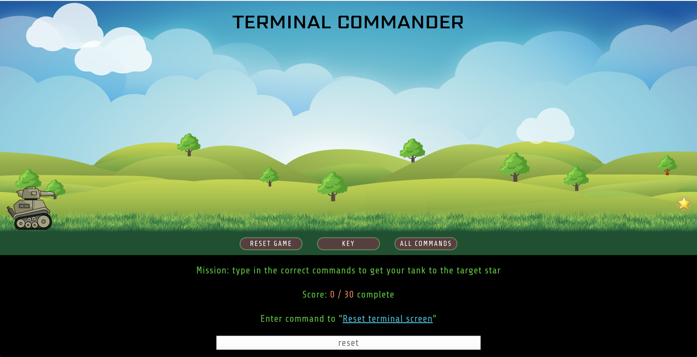
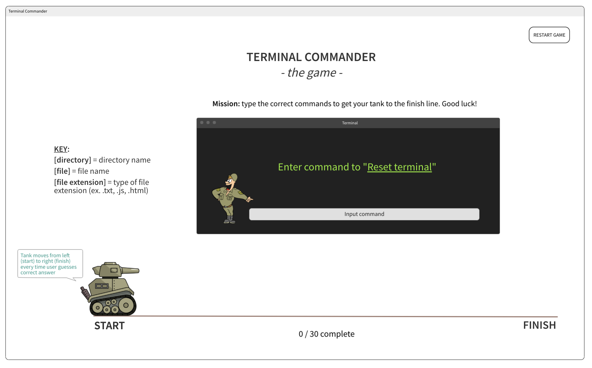

# Terminal Commander - the game
A web-based React game that allows users to enhance muscle memory by repetitively typing actual terminal commands into the input box.

## Link to Deployed App
[Terminal Commander Game](https://terminal-commander.herokuapp.com/)

## Final App Screenshot

## Beginning Wireframes

## Installation
- Clone the repo: git clone https://github.com/hlhartley/terminal-commander
- Install dependencies: npm install
- Start Local Host: npm start
- For testing suite: npm test

## Background / About
Terminal Commander was an individual project built using React. It was intended to help new MAC users as well as users unfamiliar with MAC Terminal Commands. The project required making a dataset of 30 terminal commands with associated descriptions and then using the Fetch API call to import data directly into the app. There are 30 total commands and the tank image moves across the screen as the user types in the correct command. Once a user types in all 30 commands correctly, they win the game!

## Primary Technologies Used
- React
- SCSS
- Jest
- Enzyme
